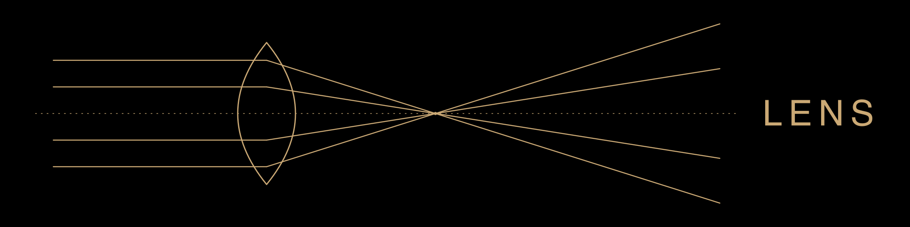

<p align="center">
  
</p>

<p align="center">
  <b>Cognitive infrastructure for LLM reasoning.</b><br>
  It pulls an LLM off its most probable answer and into the tails of the distribution — where the non-obvious lives.
</p>

<p align="center">
  <a href="https://github.com/frescodicredito/lens/actions/workflows/ci.yml"></a>
  <a href="LICENSE"></a>
  <a href="https://www.python.org/downloads/"></a>
  <a href="https://modelcontextprotocol.io/"></a>
</p>

Like a camera lens that doesn't change the scene but frames it differently, Lens changes the LLM's *observation point*. It's an [MCP](https://modelcontextprotocol.io/) server plus a set of Claude Code skills that wrap any topic in **structural cognitive constraints**, run multiple constrained agents, and synthesize the result into a map of the field.

---

## Why

LLMs answer with the most **statistically probable** response. The center of the distribution is dense with the obvious, the safe, the mediocre. Real creativity, unusual connections, and non-linear perspectives live in the **tails**.

A constraint is the steering wheel. Instead of asking *"is launching a free tier a good idea?"* and getting the balanced, forgettable answer, Lens forces the model down specific cognitive paths and collides the results:

```text
Topic:  "Launch a free tier for our B2B SaaS"

Lens composes  →  You are an analyst bound by the following cognitive rules.
                  ## Active constraints
                  1. The project has FAILED. Reconstruct the 5 main factors
                     with their causal chain          ← premortem constraint
                  2. Argue the opposite with concrete evidence and
                     structured reasoning             ← inversion constraint
```

Two agents, two incompatible vantage points, one synthesized **Field Map** of convergences, divergences and blind spots — instead of one safe paragraph. That's the whole idea.

## See it in 30 seconds

Requires Python 3.11+ and [uv](https://docs.astral.sh/uv/). No MCP setup needed for this:

```bash
git clone https://github.com/frescodicredito/lens.git
cd lens
uv sync

python examples/quickstart.py      # compose a constrained prompt, end to end
python tests/test_integrity.py     # validate the data graph  →  7/7 passed
```

`quickstart.py` prints the full system prompt Lens builds from two constraints. That prompt is what gets handed to a subagent; wiring Lens into Claude Code (see [Setup](#setup-claude-code)) just automates running many such agents and synthesizing their output.

## How it works

Lens is built from three primitives, in order of importance:

### 1. Constraints — the primitive

The atomic unit. Everything else is built on constraints. Each one is a structural rule that forces a specific thinking pattern, backed by a named theory and tunable in **intensity (1–5)**.

**25 constraints across 7 categories** ([full reference →](docs/CONSTRAINTS.md)):

| Category | Constraints |
|----------|-------------|
| `structural` | inversion · limit · role · anchor_break |
| `temporal` | temporal · premortem |
| `semantic` | exclusion |
| `modal` | modal · wise_mind |
| `creative` | bisociative · janusian · provocation · defamiliarize · synectics · scamper · dissonance |
| `analytical` | abductive · elm_route · concept_fan · assumption_reversal · steelman |
| `baseline_breaking` | anti_sycophancy · anti_completeness · anti_coherence · raw_signal |

### 2. Topologies — how agents interact

A topology defines how multiple constrained agents are arranged and how they exchange output. **13 topologies** ([full reference →](docs/TOPOLOGIES.md)), from a quick 2-agent dialectic to a 5-agent adversarial jury:

| Topology | Mode | Agents | What it does |
|----------|------|--------|--------------|
| `cascade` | QUICK | 2–4 | Hegelian dialectic: thesis → antithesis → synthesis |
| `star` | DEEP | 3–6 | Delphi: independent round, then revision, then synthesis |
| `adversarial_jury` | DEEP | 5 | 2 debate, 3 judge independently |
| `scenario_matrix` | DEEP | 4–5 | 2×2 uncertainty matrix, one agent per scenario |
| `bisociation_engine` | QUICK | 3–4 | Koestler: collide incompatible frames |
| `sequential_chain` | DEEP | 1 | Single agent, deepening chain of constraints |

…and 7 more. `/lens` can pick one for you.

### 3. Personas — constraint bundles

Lightweight cognitive templates: a bundle of constraints + a psychology profile. Not elaborate characters — cognitive configurations backed by theory (e.g. a skeptical CTO, a critical journalist). 5 built in, plus an adapter to ground personas in real audience data.

## What you get

### Claude Code skills (the interface)

Nine `/lens*` skills orchestrate sessions for you (bundled in [`skills/`](skills/)):

| Skill | Mode | Use it to… |
|-------|------|-----------|
| `/lens` | DEEP | start here — it suggests a topology and runs the session |
| `/lens-perspective` | QUICK | get a single constrained perspective on any topic |
| `/lens-adversarial` | QUICK | stress-test a claim through an adversarial cascade |
| `/lens-premortem` | QUICK | structured premortem analysis (Klein) |
| `/lens-focus-group` | DEEP | simulate a cognitive focus group with personas |
| `/lens-steelman` | QUICK | build the strongest argument, then attack it |
| `/lens-scenarios` | DEEP | strategic scenario planning (2×2 matrix) |
| `/lens-assumptions` | QUICK/DEEP | uncover and invert hidden assumptions |
| `/lens-deep` | DEEP | single-agent sequential chain with progressive constraints |

### Output formats

Sessions render into purpose-built shapes, not walls of text: **Perspective Card** (single agent), **Field Map** (convergences / divergences / outliers / synthesis), **Delta Report** (baseline vs. constrained), **Cascade Report**, **Chain Output**, **Decision Brief**, **Executive Extract**.

### MCP tools (the engine)

25 FastMCP tools power everything above — constraints, personas, topologies, composition, session persistence, and Meta-Lens analytics that learn which constraints work over time. <details><summary>Full tool list</summary>

**Constraints** — `lens_list_constraints` · `lens_get_constraint`
**Personas** — `lens_list_personas` · `lens_get_persona`
**Topologies** — `lens_list_topologies` · `lens_get_topology`
**Composition** — `lens_compose_prompt` · `lens_compose_persona` · `lens_compose_baseline` · `lens_compose_sequential` · `lens_suggest_constraints` · `lens_quick_start`
**Sessions** — `lens_session_save` · `lens_session_update` · `lens_session_list` · `lens_efficacy_report`
**Meta-Lens** — `lens_meta_constraint_efficacy` · `lens_meta_topology_efficacy` · `lens_meta_patterns` · `lens_meta_suggest` · `lens_meta_sequence_efficacy` · `lens_meta_implementation_rate` · `lens_meta_roi`
**Integrations** — `lens_persona_from_miner` · `lens_personas_from_miner_batch`

> Meta-Lens tools are empty by design on a fresh install — they populate as you save and rate sessions.
</details>

## Setup (Claude Code)

**1. Register the MCP server** in `~/.claude/settings.json`:

```json
{
  "mcpServers": {
    "lens": {
      "command": "uv",
      "args": ["run", "--project", "/path/to/lens", "python", "/path/to/lens/server.py"]
    }
  }
}
```

**2. Install the skills** so the `/lens*` commands are available:

```bash
cp -R /path/to/lens/skills/* ~/.claude/skills/
```

Then run `/lens` and let it suggest a topology.

## Repository layout

```
lens/
├── server.py              # FastMCP server (25 tools)
├── constraints/           # library.json (the 25 constraints) + composer.py
├── topologies/            # definitions.json (the 13 topologies)
├── personas/templates/    # 5 cognitive templates
├── output/formatter.py    # 7 output formats
├── meta/analytics.py      # efficacy tracking, pattern mining, data-driven suggestions
├── integrations/miner.py  # optional adapter: external audience data → personas
├── skills/                # 9 Claude Code orchestration skills
├── examples/              # runnable quickstart
├── tests/                 # data-graph integrity tests
├── scripts/gen_docs.py    # regenerates docs/ from the JSON
├── docs/                  # generated CONSTRAINTS.md + TOPOLOGIES.md
├── LENS.md                # foundational document (theory & design)
└── research/              # THEORETICAL_FOUNDATIONS.md (20+ theories)
```

## Design principles

1. **The constraint is the primitive.** Everything builds on constraints. *(Stokes, TRIZ)*
2. **Reasoning is social.** Multi-agent is the natural mode. *(Mercier & Sperber)*
3. **Map, not answer.** The output is a map of the field, not "the best answer". *(Delphi, ACH)*
4. **Separate production from evaluation.** Who generates should not judge. *(Osborn–Parnes)*
5. **Independence first, interaction after.** Round-1 independence is necessary. *(Surowiecki)*
6. **Structured dissent, not chaos.** Conflict is programmed, not random. *(Janis)*
7. **Transcendence, not compromise.** Seek frameworks that contain both positions. *(Rothenberg)*

Grounded in 20+ validated theories — see [`LENS.md`](LENS.md) and [`research/THEORETICAL_FOUNDATIONS.md`](research/THEORETICAL_FOUNDATIONS.md).

## Contributing

Adding a constraint, topology, or persona rarely requires touching Python — it's all data-driven. See [CONTRIBUTING.md](CONTRIBUTING.md). Please run `python tests/test_integrity.py` before opening a PR.

## License

[MIT](LICENSE) © Francesco Di Credico · Roadmap in [ROADMAP.md](ROADMAP.md) · Changes in [CHANGELOG.md](CHANGELOG.md)
